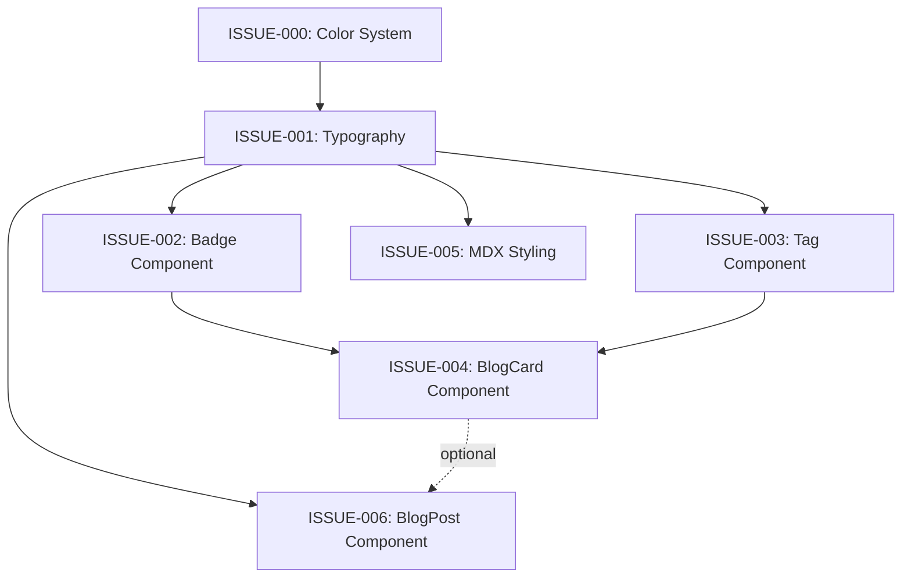

# Sprint: Magazine-Style Blog Redesign

**Sprint Goal**: Transform blog from generic appearance to bold, magazine-inspired design with PC Gamer influence and warm flannel palette.

**Duration**: TBD
**Priority Focus**: BlogCard redesign (highest visual impact)

---

## Table of Contents
1. [Sprint Overview](#sprint-overview)
2. [Issue Dependency Map](#issue-dependency-map)
3. [Issues by Priority](#issues-by-priority)
4. [Definition of Done Checklist](#definition-of-done-checklist)

---

## Sprint Overview

### Success Metrics
- Cards look like magazine feature boxes, not generic blog posts
- Flannel colors are bold and noticeable
- Typography has clear, magazine-style hierarchy
- Hover states are confident and obvious
- Overall feel: "PC Gamer meets cozy developer blog"

### Components to Update
```
components/
├── atoms/
│   ├── Badge/          [ISSUE-002]
│   └── Text/           [ISSUE-001]
├── molecules/
│   ├── BlogCard/       [ISSUE-004] 🎯 PRIORITY
│   └── TagList/        [ISSUE-003]
└── organisms/
    └── BlogPost/       [ISSUE-006]

app/
└── globals.css         [ISSUE-001, ISSUE-005]
```

---

## Issue Dependency Map



### Dependency Details

**Foundation (No Dependencies)**:
- ISSUE-000: Color System Enhancement

**Phase 1 (Depends on: Color System)**:
- ISSUE-001: Typography Enhancement

**Phase 2 (Depends on: Typography)**:
- ISSUE-002: Badge Component
- ISSUE-003: Tag Component

**Phase 3 (Depends on: Typography, Badge, Tag)**:
- ISSUE-004: BlogCard Component 🎯 HIGH PRIORITY

**Phase 4 (Depends on: Typography)**:
- ISSUE-005: MDX Content Styling
- ISSUE-006: BlogPost Component (optional: BlogCard)

---

## Issues by Priority

---

### ISSUE-000: Color System Enhancement
**Priority**: P0 (Foundation)
**Complexity**: Low
**Dependencies**: None

#### Entrance Criteria
- [ ] Current color palette defined in `app/globals.css`
- [ ] Aesthetic.md color guidelines reviewed
- [ ] Access to globals.css file

#### Tasks
1. Add enhanced palette colors to CSS variables
2. Create color usage documentation
3. Define magazine-style color blocking patterns
4. Test color contrast ratios (WCAG AA)

#### Files to Modify
- `app/globals.css` - Add new color variables

#### Exit Criteria
- [ ] New color variables added to globals.css:
  - `--burgundy-dark: #6B3352`
  - `--rust-bright: #E89A7F`
  - `--denim-deep: #4A6B7D`
  - `--cream-warm: #F5EBE0`
- [ ] All color variables documented with usage comments
- [ ] Color contrast tested (min 4.5:1 for text)
- [ ] No visual regressions in existing components
- [ ] Colors visible in browser dev tools

#### Acceptance Criteria
```css
/* Enhanced Flannel Palette */
--burgundy-dark: #6B3352;    /* Rich, deeper for text on burgundy */
--rust-bright: #E89A7F;       /* Lighter rust for highlights */
--denim-deep: #4A6B7D;        /* Deeper denim for technical sections */
--cream-warm: #F5EBE0;        /* Warmer cream for backgrounds */
```

#### Testing
- Visual inspection in light mode
- Verify no breaking changes to existing styles
- Confirm colors match aesthetic.md specifications

---

### ISSUE-001: Typography Enhancement
**Priority**: P0 (Foundation)
**Complexity**: Medium
**Dependencies**: ISSUE-000

#### Entrance Criteria
- [ ] Color system enhanced (ISSUE-000 complete)
- [ ] Inter font family available in project
- [ ] Geist Mono available in project
- [ ] Current typography reviewed in `app/globals.css`

#### Tasks
1. Add magazine-style type scale to globals.css
2. Create Text component display variant (900 weight)
3. Add pull quote typography styles
4. Update heading styles for magazine boldness
5. Test typography hierarchy across all screen sizes

#### Files to Modify
- `app/globals.css` - Type scale, heading styles
- `components/atoms/Text/Text.tsx` - Add display variant
- `components/atoms/Text/Text.types.ts` - Add display to variant enum

#### Exit Criteria
- [ ] Type scale implemented with magazine-style weights:
  - Display (H1): 3.5-4rem, weight 900
  - Headline (H2): 2.5-3rem, weight 800
  - Subhead (H3): 1.75-2rem, weight 700
- [ ] Text component has `display` variant with extra bold (900) weight
- [ ] Pull quote styles added to prose classes
- [ ] All headings use bold magazine-style weights
- [ ] Typography hierarchy tested on mobile/tablet/desktop
- [ ] Line heights appropriate (1.6-1.8 for body)
- [ ] Letter spacing adjusted for display headings

#### Acceptance Criteria
```tsx
// Text component usage
<Text variant="display" className="font-black">
  BOLD ARTICLE TITLE
</Text>

<Text variant="headline" className="font-extrabold">
  Section Header
</Text>
```

```css
/* globals.css */
h1 { font-size: 3.5rem; font-weight: 900; }
h2 { font-size: 2.5rem; font-weight: 800; }
h3 { font-size: 1.75rem; font-weight: 700; }
```

#### Testing
- Visual hierarchy clear at all breakpoints
- Headings bold and magazine-like
- Pull quotes distinctive and eye-catching
- No font loading flashes (FOUT/FOIT)

---

### ISSUE-002: Badge Component Enhancement
**Priority**: P1
**Complexity**: Low
**Dependencies**: ISSUE-001

#### Entrance Criteria
- [ ] Typography enhancement complete (ISSUE-001)
- [ ] Color system enhanced (ISSUE-000)
- [ ] Badge component exists at `components/atoms/Badge/`
- [ ] Component structure reviewed

#### Tasks
1. Update Badge styles for full background colors (not outlines)
2. Add category variant (burgundy/rust/denim)
3. Add featured variant with gradient
4. Implement magazine section marker styling
5. Add uppercase text transformation
6. Test all variants visually

#### Files to Modify
- `components/atoms/Badge/Badge.tsx`
- `components/atoms/Badge/Badge.types.ts`
- `components/atoms/Badge/Badge.module.css` (or Tailwind classes)

#### Exit Criteria
- [ ] Badge variants implemented:
  - `category-burgundy`: Full burgundy background, white text
  - `category-rust`: Full rust background, white text
  - `category-denim`: Full denim background, white text
  - `featured`: Burgundy-to-rust gradient with shadow
- [ ] All badges use full color fills (not borders/outlines)
- [ ] Text is uppercase with letter spacing (0.05em)
- [ ] Font weight is 700 (bold)
- [ ] Border radius is subtle (0.25rem)
- [ ] Padding is appropriate (0.25rem 0.75rem)
- [ ] Featured badge has box-shadow
- [ ] All variants tested and visible

#### Acceptance Criteria
```tsx
// Badge usage examples
<Badge variant="category-burgundy">ARTICLES</Badge>
<Badge variant="category-rust">TUTORIALS</Badge>
<Badge variant="featured">FEATURED</Badge>
```

```css
/* Example styling */
.badge-category-burgundy {
  background: var(--accent-burgundy);
  color: white;
  font-weight: 700;
  text-transform: uppercase;
  letter-spacing: 0.05em;
}

.badge-featured {
  background: linear-gradient(135deg, var(--accent-burgundy), var(--accent-rust));
  box-shadow: 0 4px 12px rgba(201, 125, 95, 0.4);
}
```

#### Testing
- All badge variants render correctly
- Colors are bold and visible
- Text is readable on colored backgrounds
- Contrast ratios meet WCAG AA standards
- Badges look like magazine section markers

---

### ISSUE-003: Tag Component Enhancement
**Priority**: P1
**Complexity**: Low
**Dependencies**: ISSUE-001

#### Entrance Criteria
- [ ] Typography enhancement complete (ISSUE-001)
- [ ] Color system enhanced (ISSUE-000)
- [ ] Tag or TagList component exists
- [ ] Current tag styling reviewed

#### Tasks
1. Replace outline style with solid fills
2. Add bold hover states with color transitions
3. Implement pill-shaped border radius
4. Add lift effect on hover (translateY)
5. Make tags fully interactive/clickable
6. Test hover states and transitions

#### Files to Modify
- `components/molecules/TagList/TagList.tsx` (or atoms/Tag/)
- `components/molecules/TagList/Tag.tsx`
- Related CSS/styling files

#### Exit Criteria
- [ ] Tags use solid color fills (not outlines):
  - Background: `var(--accent-cream)`
  - Text: `var(--accent-rust)`
  - Border: `2px solid var(--accent-rust)`
- [ ] Hover state implemented:
  - Background changes to `var(--accent-rust)`
  - Text changes to white
  - Lift effect: `translateY(-2px)`
  - Box shadow appears
- [ ] Border radius is pill-shaped (1rem)
- [ ] Padding is generous (0.375rem 0.875rem)
- [ ] Font weight is 600 (semi-bold)
- [ ] Transition is smooth (0.2s ease-out)
- [ ] Tags are keyboard accessible (focus states)
- [ ] Click/tap targets are adequate (min 44x44px)

#### Acceptance Criteria
```tsx
// Tag usage
<Tag href="/tags/react" className="tag-interactive">
  React
</Tag>
```

```css
/* Tag styling */
.tag {
  background: var(--accent-cream);
  color: var(--accent-rust);
  border: 2px solid var(--accent-rust);
  border-radius: 1rem;
  padding: 0.375rem 0.875rem;
  font-weight: 600;
  transition: all 0.2s ease-out;
}

.tag:hover {
  background: var(--accent-rust);
  color: white;
  transform: translateY(-2px);
  box-shadow: 0 2px 8px rgba(201, 125, 95, 0.2);
}
```

#### Testing
- Tags are bold and visible
- Hover states are obvious and smooth
- Transitions feel premium
- Focus states are clear for keyboard navigation
- Tags work on touch devices
- Color contrast is sufficient

---

### ISSUE-004: BlogCard Component Redesign 🎯
**Priority**: P0 (HIGHEST IMPACT)
**Complexity**: High
**Dependencies**: ISSUE-001, ISSUE-002, ISSUE-003

#### Entrance Criteria
- [ ] Typography enhancement complete (ISSUE-001)
- [ ] Badge component enhanced (ISSUE-002)
- [ ] Tag component enhanced (ISSUE-003)
- [ ] BlogCard component exists
- [ ] Example blog posts available for testing
- [ ] Design examples reviewed (`/ai_docs/design-examples/blog-log/`)

#### Tasks
1. Redesign card layout as magazine feature box
2. Add bold featured image with overlay
3. Implement full-color category badge
4. Update title typography to magazine headline style
5. Add excerpt with proper truncation
6. Integrate enhanced Tag components
7. Add metadata bar with icons (monospace option)
8. Implement magazine-style hover states
9. Create featured post variant (larger, bolder)
10. Test responsive behavior across breakpoints
11. Ensure accessibility (ARIA labels, keyboard nav)

#### Files to Modify
- `components/molecules/BlogCard/BlogCard.tsx`
- `components/molecules/BlogCard/BlogCard.types.ts`
- `components/molecules/BlogCard/BlogCard.module.css` (or Tailwind)
- Related utility files

#### Exit Criteria
- [ ] Card structure follows magazine feature box layout:
  ```
  ┌─────────────────────────────────┐
  │  [Featured Image with Overlay]  │
  │  [Category Badge - Full Color]  │
  │  ─────────────────────────────  │
  │  BOLD TITLE (Headline Style)    │
  │  Excerpt text (2-3 lines)...    │
  │  ─────────────────────────────  │
  │  [Tag] [Tag]  Author • Date →   │
  └─────────────────────────────────┘
  ```
- [ ] Featured image is prominent (full-width or large)
- [ ] Image has magazine cover-style overlay (gradient or tint)
- [ ] Category badge uses FULL color background (from ISSUE-002)
- [ ] Badge placement: top-right or top-left corner
- [ ] Title uses bold typography (1.75-2rem, weight 700)
- [ ] Title hover changes color to rust
- [ ] Excerpt is 2-3 lines max with proper truncation
- [ ] Tags use enhanced Tag component (from ISSUE-003)
- [ ] Metadata includes: author, date, reading time
- [ ] Metadata uses monospace font option
- [ ] Hover state implemented:
  - Card lifts: `translateY(-4px) scale(1.02)`
  - Shadow increases: `0 12px 24px rgba(0,0,0,0.15)`
  - Image zooms slightly: `scale(1.05)`
  - Title color changes to rust
  - Transition: 0.3s smooth
- [ ] Featured variant exists:
  - Larger size
  - "FEATURED" ribbon/badge in rust
  - Enhanced image treatment
  - Magazine "cover story" feel
- [ ] Responsive at mobile (1 column), tablet (2 cols), desktop (3 cols)
- [ ] ARIA labels for accessibility
- [ ] Keyboard navigation works (focus states clear)
- [ ] Links are semantic (`<Link>` or `<a>`)

#### Acceptance Criteria
```tsx
// BlogCard usage
<BlogCard
  title="Building Modern Web Apps"
  excerpt="A deep dive into modern web development..."
  image="/images/web-apps.jpg"
  category="TUTORIALS"
  categoryColor="rust"
  author="Walter"
  date="2025-01-14"
  readTime="5 min"
  tags={["React", "Next.js", "TypeScript"]}
  href="/blog/building-modern-web-apps"
/>

// Featured variant
<BlogCard
  featured
  title="Featured: AI in Development"
  {...props}
/>
```

#### Visual Requirements
- Cards look like magazine feature boxes
- Bold and eye-catching (not generic)
- Flannel colors are prominent and visible
- Typography hierarchy is clear
- Hover states are confident and obvious
- Images have magazine cover quality

#### Testing
- Visual inspection across all breakpoints
- Test with various content lengths (short/long titles, excerpts)
- Verify all hover states work smoothly
- Test keyboard navigation (Tab, Enter)
- Test with screen reader (VoiceOver/NVDA)
- Verify color contrast ratios
- Test featured variant separately
- Compare against PC Gamer examples in `/ai_docs/design-examples/`

---

### ISSUE-005: MDX Content Styling
**Priority**: P2
**Complexity**: Medium
**Dependencies**: ISSUE-001

#### Entrance Criteria
- [ ] Typography enhancement complete (ISSUE-001)
- [ ] Color system enhanced (ISSUE-000)
- [ ] MDX content rendering in blog posts
- [ ] Current prose styles reviewed in `app/globals.css`

#### Tasks
1. Add magazine-style pull quote styling
2. Create technical callout box styles
3. Enhance code block presentation (magazine sidebar treatment)
4. Add photo caption styling
5. Create bold section header styles (H2/H3 in content)
6. Implement drop cap styling (optional)
7. Test all MDX elements with real content

#### Files to Modify
- `app/globals.css` - Prose/MDX styles
- Create `components/mdx/` utilities if needed (Callout, PullQuote, etc.)

#### Exit Criteria
- [ ] Pull quote styles implemented:
  - Font size: 1.5rem
  - Font weight: 700
  - Color: `var(--accent-rust)`
  - Border left: 4px solid burgundy
  - Padding left: 1.5rem
  - Italic style
  - Margin: 2rem 0
- [ ] Callout box styles (magazine feature box):
  - Background: `var(--accent-burgundy)` or cream
  - Color: white (on burgundy) or dark (on cream)
  - Padding: 1.5rem
  - Border radius: 0.5rem
  - Bold title with uppercase and letter spacing
- [ ] Code block enhancement:
  - Background: `var(--accent-cream)`
  - Border left: 4px solid rust
  - Padding: 1.5rem
  - Monospace font
  - Magazine "technical sidebar" feel
- [ ] Image captions:
  - Font size: 0.875rem
  - Italic style
  - Center aligned
  - Color: muted text
  - Margin top: 0.5rem
- [ ] Section headers (H2/H3) in content:
  - Bold, magazine section marker style
  - H2: Full-width with optional color bar
  - H3: Rust color accent
- [ ] Drop caps (optional):
  - First letter large
  - Burgundy or rust color
  - Floated left
  - PC Gamer magazine style
- [ ] All elements tested with real blog content
- [ ] Responsive behavior verified

#### Acceptance Criteria
```css
/* Pull quote */
.prose blockquote.pull-quote {
  font-size: 1.5rem;
  font-weight: 700;
  color: var(--accent-rust);
  border-left: 4px solid var(--accent-burgundy);
  padding-left: 1.5rem;
  font-style: italic;
  margin: 2rem 0;
}

/* Callout box */
.prose .callout {
  background: var(--accent-burgundy);
  color: white;
  padding: 1.5rem;
  border-radius: 0.5rem;
  margin: 2rem 0;
}

/* Code block */
.prose pre {
  background: var(--accent-cream);
  border-left: 4px solid var(--accent-rust);
  padding: 1.5rem;
  border-radius: 0.5rem;
}
```

#### Testing
- Create test MDX file with all elements
- Visual inspection of pull quotes, callouts, code blocks
- Test with various content lengths
- Verify responsive behavior
- Check readability and contrast
- Compare to magazine article examples

---

### ISSUE-006: BlogPost Component Enhancement
**Priority**: P2
**Complexity**: Medium
**Dependencies**: ISSUE-001, (optional: ISSUE-004)

#### Entrance Criteria
- [ ] Typography enhancement complete (ISSUE-001)
- [ ] MDX styling complete (ISSUE-005)
- [ ] BlogPost component exists
- [ ] Article layout reviewed

#### Tasks
1. Create magazine-style article header
2. Add feature image treatment (magazine cover style)
3. Implement metadata bar with rust accents
4. Update article layout (main content + sidebar)
5. Add table of contents (TOC) styling
6. Test with real blog posts

#### Files to Modify
- `components/organisms/BlogPost/BlogPost.tsx`
- `components/organisms/BlogPost/BlogPost.module.css`
- Related layout components

#### Exit Criteria
- [ ] Article header implemented:
  ```
  [Category Badge]
  BOLD ARTICLE TITLE
  Subheading or excerpt
  By Walter • Date • Reading time
  ```
- [ ] Feature image has magazine cover treatment:
  - Full-width or prominent placement
  - Optional gradient overlay
  - Border radius: 0.5rem
  - Box shadow: subtle depth
- [ ] Metadata bar styled with rust accents:
  - Author, date, reading time
  - Optional monospace font
  - Icon integration
  - Clear visual separation
- [ ] Article layout implemented:
  - Main content column (readable width)
  - Optional sidebar (TOC, tags, meta)
  - Magazine column layout
- [ ] TOC styling (if present):
  - Sticky positioning
  - Rust color for active section
  - Clean, hierarchical
- [ ] Responsive: sidebar moves below on mobile
- [ ] Typography uses enhanced system
- [ ] All elements accessible (semantic HTML)

#### Acceptance Criteria
```tsx
// BlogPost structure
<BlogPost>
  <ArticleHeader
    title="Article Title"
    category="TUTORIALS"
    author="Walter"
    date="2025-01-14"
    readTime="5 min"
    featuredImage="/images/article.jpg"
  />
  <ArticleBody>
    {/* MDX content */}
  </ArticleBody>
  <ArticleSidebar>
    <TOC />
    <TagList />
  </ArticleSidebar>
</BlogPost>
```

#### Testing
- Visual inspection with real articles
- Test header with various title lengths
- Verify metadata displays correctly
- Test TOC navigation (scroll spy)
- Verify responsive layout
- Check accessibility (headings, landmarks)

---

## Definition of Done Checklist

### For Each Issue
- [ ] Entrance criteria met before starting
- [ ] All tasks completed
- [ ] Exit criteria verified (every checkbox checked)
- [ ] Code reviewed for quality and maintainability
- [ ] Visual inspection performed
- [ ] Responsive behavior tested (mobile, tablet, desktop)
- [ ] Accessibility verified (WCAG AA)
- [ ] No console errors or warnings
- [ ] Git commit made with clear message
- [ ] Dependencies updated (if issue unblocks others)

### For Sprint Completion
- [ ] All P0 issues complete (ISSUE-000, ISSUE-001, ISSUE-004)
- [ ] All P1 issues complete (ISSUE-002, ISSUE-003)
- [ ] Visual comparison to aesthetic.md goals
- [ ] Success metrics evaluated:
  - [ ] Cards look like magazine feature boxes
  - [ ] Flannel colors are bold and visible
  - [ ] Typography has clear hierarchy
  - [ ] Hover states are confident
  - [ ] Overall feel is "PC Gamer meets cozy developer blog"
- [ ] User acceptance testing
- [ ] Performance verified (no significant regressions)
- [ ] Sprint retrospective completed

---

## Implementation Order

### Recommended Sequence

1. **ISSUE-000** (Color System) - Foundation, quick win
2. **ISSUE-001** (Typography) - Foundation, enables everything else
3. **Parallel**:
   - **ISSUE-002** (Badge) - Quick, high impact
   - **ISSUE-003** (Tag) - Quick, high impact
4. **ISSUE-004** (BlogCard) - Main priority, requires 001/002/003
5. **Parallel**:
   - **ISSUE-005** (MDX Styling)
   - **ISSUE-006** (BlogPost Component)

### Time Estimates (approximate)
- ISSUE-000: 1-2 hours
- ISSUE-001: 3-4 hours
- ISSUE-002: 2-3 hours
- ISSUE-003: 2-3 hours
- ISSUE-004: 6-8 hours (most complex)
- ISSUE-005: 4-5 hours
- ISSUE-006: 4-5 hours

**Total**: ~22-30 hours of development time

---

## Notes for Agents

### General Guidelines
- Read aesthetic.md thoroughly before starting any issue
- Reference `/ai_docs/design-examples/blog-log/` for PC Gamer inspiration
- Test all changes visually, not just programmatically
- Maintain existing functionality while enhancing design
- When in doubt about styling, err on the side of boldness (not subtlety)

### Critical Success Factors
1. **BlogCard redesign** is the highest priority - biggest visual impact
2. **Foundation first** - Colors and typography enable everything else
3. **Bold, not subtle** - Magazine feel requires confidence in design choices
4. **Test with real content** - Use actual blog posts, not lorem ipsum
5. **Accessibility matters** - Don't sacrifice usability for aesthetics

### Common Pitfalls to Avoid
- ❌ Making colors too subtle (they should pop!)
- ❌ Weak typography weights (use 700-900 for headings)
- ❌ Generic card designs (think magazine feature box)
- ❌ Shy hover states (make them obvious)
- ❌ Skipping responsive testing
- ❌ Forgetting accessibility

---

*Last updated: January 2025*
*Reference: `/ai_docs/aesthetic.md`, `/ai_docs/design-examples/`*
